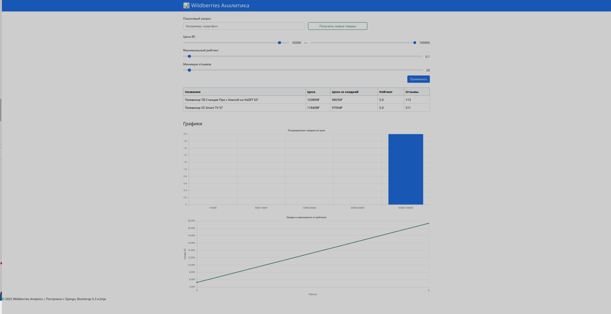
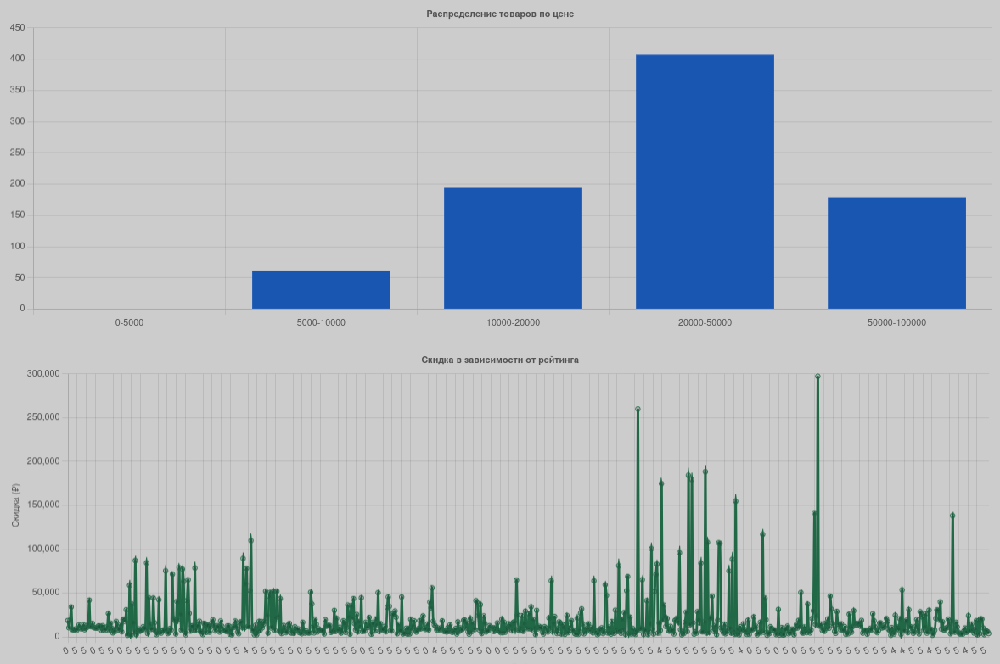
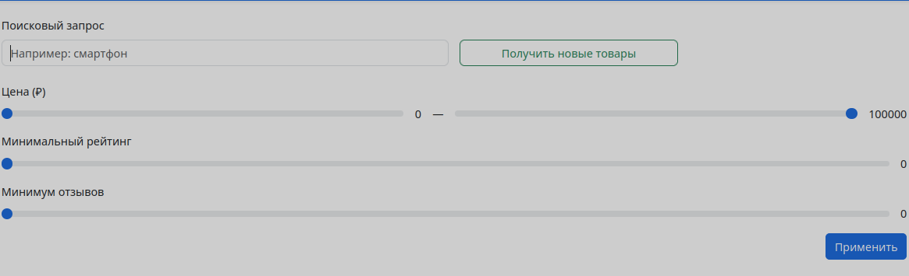

# Wildberries Analytics

Сервис аналитики товаров Wildberries: парсинг, REST API, фильтрация и визуализация данных.

---

## 🚀 Возможности

- Парсинг до N страниц товаров WB с фильтрацией
- Сохраняются: название, цена, цена со скидкой, рейтинг, количество отзывов
- DRF API с фильтрацией по цене, рейтингу, отзывам и сортировкой
- Веб-интерфейс с:
  - Ползунками-фильтрами
  - Таблицей товаров
  - Графиками (гистограмма + скидка vs рейтинг)
  - Панелью управления парсером (запуск из браузера)

---

## 🛠 Технологии

| Компонент        | Стек                                |
|------------------|--------------------------------------|
| Backend          | Django 5.2, DRF, SQLite              |
| API              | Django REST Framework, django-filter |
| Парсер           | requests, logging, management command |
| Frontend         | Jinja2, Bootstrap 5.3, Chart.js, AJAX |
| DevOps           | Docker, docker-compose, .env         |

---

## 📁 Структура проекта

```
test_task/
├── app/              # Парсер Wildberries
├── api/              # DRF API и фильтры
├── database/         # Модель Product
├── frontend/         # Jinja, views, templates
├── static/           # Bootstrap, custom.js/css
├── docker/           # Dockerfile и entrypoint
├── test_task/        # Настройки Django
├── templates/        # Базовые шаблоны
├── manage.py
├── requirements.txt
├── docker-compose.yml
├── .env
└── README.md
```

---

## ⚙️ Установка и запуск

```bash
# Установить зависимости
sudo apt update
sudo apt install docker.io docker-compose-v2

git clone https://github.com/smartsoltech/test_task.git

cd test_task

# Сборка и запуск
docker compose up -d --build

# Проверка
docker ps -a
```

## 🔗 Веб-интерфейс

- `GET /` — фильтры, таблица, графики
- `POST /run-parser/` — запуск парсера из браузера (поисковый запрос)
- `GET /filter/` — AJAX фильтрация
- `GET /api/products/` — REST API с фильтрацией и сортировкой
- `GET /docs/` — Swagger-документация (drf-yasg)
```
---


## ⚙️ Переменные окружения (.env)

```env
# Django
DEBUG=True
DJANGO_SECRET_KEY=your-secret-key
ALLOWED_HOSTS=localhost,127.0.0.1
CSRF_TRUSTED_ORIGINS=http://localhost:8000,http://127.0.0.1:8000
SESSION_COOKIE_SECURE=False
CSRF_COOKIE_SECURE=False

# Парсер
PARSER_MAX_PAGES=5
PARSER_USER_AGENT=Mozilla/5.0
PARSER_APP_TYPE=1
PARSER_DEST=-1257786
PARSER_SPP=30

```

---

## ✅ Готовность

Проект соответствует требованиям тестового задания:

- Полностью функциональный
- Разделён по микросервисной логике (модули: API, UI, парсинг)
- Поддерживает Docker-деплой
- Визуализирует данные графически и таблично
- Предоставляет REST-интерфейс

---

## 🖼 Примеры интерфейса

### Главная страница с фильтрами и таблицей



### Визуализация графиков



### Парсер и фильтры



---

## API Документация

Документация по API доступна по адресу 

1. [Swagger](http://127.0.0.1:8000/docs/)


2. [ReDoc](http://127.0.0.1:8000/redoc/)


---

## 👤 Автор

Тестовое задание. Разработано в рамках демонстрации навыков Python/Django/Fullstack.

***Цой Андрей***
